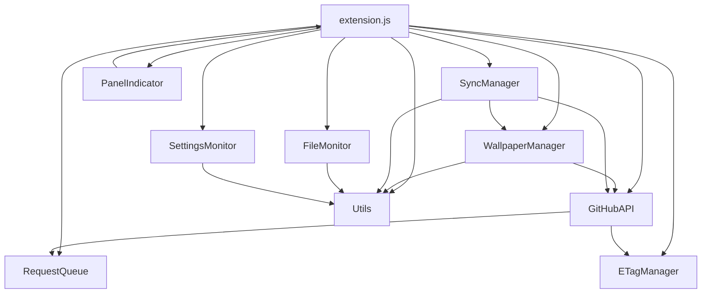

# Gnoming Profiles - Project Structure

## Directory Structure

```
gnoming-profiles/
├── extension.js                    # Main extension entry point (modular)
├── prefs.js                       # Preferences UI 
├── metadata.json                  # Extension metadata
├── stylesheet.css                 # CSS styles and animations
├── Makefile                       # Build and installation tasks
├── LICENSE                        # GNU GPL v2.0 license
├── README.md                      # Main documentation
├── STRUCTURE.md                   # This file
├── lib/                          # Modular components (NEW in v2.9)
│   ├── README.md                 # Module documentation
│   ├── RequestQueue.js           # API request concurrency management
│   ├── ETagManager.js            # ETag caching for efficient polling
│   ├── GitHubAPI.js              # GitHub API integration
│   ├── FileMonitor.js            # File system change monitoring
│   ├── SettingsMonitor.js        # GSettings change monitoring
│   ├── WallpaperManager.js       # Wallpaper syncing management
│   ├── SyncManager.js            # Sync operations coordination
│   ├── PanelIndicator.js         # GNOME Shell panel UI
│   └── Utils.js                  # Common utility functions
└── schemas/                      # GSettings schema definitions
    └── org.gnome.shell.extensions.config-sync.gschema.xml
```

## File Purposes

### Core Extension Files

- **`extension.js`**: Main extension class that orchestrates all modules and handles GNOME Shell integration
- **`prefs.js`**: Preferences window implementation using Adwaita widgets
- **`metadata.json`**: Extension metadata for GNOME Shell (name, version, compatibility)
- **`stylesheet.css`**: CSS animations and styling for panel indicator states

### Modular Library (`lib/`)

#### Infrastructure Modules
- **`RequestQueue.js`**: Manages GitHub API request concurrency to prevent rate limiting
- **`ETagManager.js`**: Handles ETag caching for bandwidth-efficient HTTP conditional requests
- **`GitHubAPI.js`**: Comprehensive GitHub API client with ETag support and Tree API batching

#### Monitoring Modules  
- **`FileMonitor.js`**: Watches configuration files for changes using Gio.FileMonitor
- **`SettingsMonitor.js`**: Monitors GSettings schemas for changes with availability checking
- **`WallpaperManager.js`**: Handles wallpaper file syncing with on-demand loading

#### Coordination Modules
- **`SyncManager.js`**: Coordinates backup/restore operations with locking and caching
- **`PanelIndicator.js`**: GNOME Shell panel integration with status display and animations

#### Utility Modules
- **`Utils.js`**: Common utility functions for path handling, validation, caching, and error handling

### Configuration

- **`schemas/`**: GSettings schema definitions for extension preferences
- **`Makefile`**: Automation for building, installing, and testing the extension

## Module Dependencies



## Key Design Principles

### Separation of Concerns
- Each module has a single, well-defined responsibility
- Clear interfaces between components
- Minimal coupling between modules

### Dependency Injection
- Modules receive dependencies through constructors
- Enables easy testing and mocking
- Promotes loose coupling

### Error Isolation
- Module failures don't cascade to other components
- Comprehensive error handling at module boundaries
- Graceful degradation when services are unavailable

### Performance Optimization
- ETag-based polling reduces bandwidth by 95%
- Request queuing prevents API rate limiting
- Content caching avoids unnecessary uploads
- On-demand loading reduces memory usage

## Build Process

```bash
# Install to local GNOME Shell extensions directory
make install

# Create distribution package
make dist

# Run performance tests
make test-performance

# Test ETag polling efficiency  
make test-etag

# Clean build artifacts
make clean
```

## Development Workflow

### Adding New Features
1. Identify the appropriate module or create a new one
2. Implement with proper error handling and logging
3. Update dependencies in main extension.js
4. Add tests for the new functionality
5. Update documentation

### Debugging
- Use `journalctl -f -o cat /usr/bin/gnome-shell | grep "Module Name"` for specific modules
- Each module includes detailed logging with identifiable prefixes
- Error conditions are logged with full context

### Testing
- Unit test individual modules with mocked dependencies
- Integration test module interactions
- End-to-end test full extension functionality

## Code Quality Standards

### Logging
- All modules use consistent logging with module prefixes
- Error conditions include full context and stack traces
- Status changes are logged for debugging

### Error Handling
- Try-catch blocks around all async operations
- Graceful degradation when services are unavailable
- Resource cleanup in finally blocks

### Documentation
- Comprehensive JSDoc comments for all public methods
- README files for complex modules
- Clear dependency documentation

### Performance
- Async/await for all I/O operations
- Efficient resource management
- Minimal memory footprint through on-demand loading

## Extension Lifecycle

1. **Enable**: Initialize all modules and setup monitoring
2. **Runtime**: Handle file/settings changes and GitHub polling
3. **Sync Operations**: Coordinate backup/restore with locking
4. **Disable**: Cleanup resources and stop all monitoring

The modular architecture ensures clean startup, efficient operation, and proper cleanup throughout the extension lifecycle.