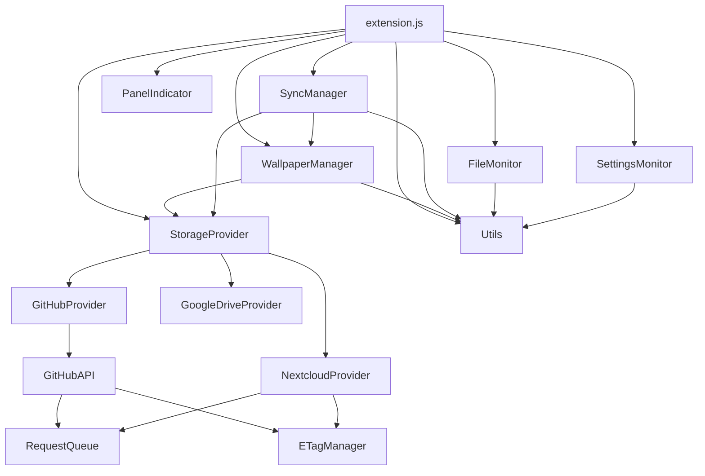

# Gnoming Profiles - Project Structure

## Directory Structure

```
gnoming-profiles/
├── extension.js                    # Main extension entry point
├── prefs.js                       # Preferences UI (Adwaita)
├── metadata.json                  # Extension metadata
├── stylesheet.css                 # CSS styles and animations
├── Makefile                       # Build and installation tasks
├── LICENSE                        # GNU GPL v2.0 license
├── README.md                      # Main documentation
├── CHANGELOG.md                   # Detailed version history
├── STRUCTURE.md                   # This file
├── MARKETING.md                   # Marketing copy
├── icons/
│   └── system-switch-user-symbolic.svg  # Panel indicator icon
├── media/
│   └── GnomingProfilesScreenshot.png    # Screenshot for README
├── dist/
│   └── *.zip                      # Distribution package
├── lib/                           # Modular components
│   ├── README.md                  # Module documentation
│   ├── StorageProvider.js         # Abstract storage backend interface
│   ├── GitHubProvider.js          # GitHub storage backend (Tree API)
│   ├── NextcloudProvider.js       # Nextcloud/WebDAV storage backend
│   ├── GoogleDriveProvider.js     # Google Drive storage backend (OAuth2)
│   ├── GitHubAPI.js               # Low-level GitHub REST API client
│   ├── RequestQueue.js            # API request concurrency management
│   ├── ETagManager.js             # ETag caching for efficient polling
│   ├── FileMonitor.js             # File system change monitoring
│   ├── SettingsMonitor.js         # GSettings change monitoring
│   ├── WallpaperManager.js        # Binary-safe wallpaper syncing
│   ├── SyncManager.js             # Sync operations coordination
│   ├── PanelIndicator.js          # GNOME Shell panel UI
│   └── Utils.js                   # Common utility functions
└── schemas/
    ├── org.gnome.shell.extensions.config-sync.gschema.xml
    └── gschemas.compiled          # Compiled schema (generated)
```

## File Purposes

### Core Extension Files

- **`extension.js`**: Main extension class — orchestrates all modules, creates the active storage provider via factory method, handles GNOME Shell lifecycle (enable/disable), session sync, polling, and live provider switching
- **`prefs.js`**: Preferences window — Adwaita tabbed UI (General, Sync, Content, Help, About) with provider selection dropdown and conditional GitHub/Nextcloud/Google Drive settings, includes OAuth2 loopback flow for Google Drive authorization
- **`metadata.json`**: Extension metadata — name, UUID, version, GNOME Shell compatibility
- **`stylesheet.css`**: CSS animations and styling for panel indicator states (syncing, monitoring, change detected)

### Storage Providers (`lib/`)

- **`StorageProvider.js`**: Abstract base class defining the storage backend contract — `uploadBatch`, `downloadFile`, `downloadBinaryFile`, `listDirectory`, `pollForChanges`, `getCredentials`, `hasValidCredentials`, `clearChangeCache`
- **`GitHubProvider.js`**: GitHub backend — atomic batch uploads via Tree API (blobs → tree → commit → ref), Content API downloads, binary support, ETag polling via commits endpoint, auto-detection of default branch
- **`NextcloudProvider.js`**: Nextcloud/WebDAV backend — file operations via PUT/GET/PROPFIND/MKCOL over Soup.Session, basic auth, incremental directory creation, PROPFIND XML parsing, ETag change detection
- **`GoogleDriveProvider.js`**: Google Drive backend — OAuth2 token management with PKCE, path-to-ID resolution cache for Drive's ID-based file system, multipart upload (`multipart/related`), `modifiedTime`-based polling, automatic folder creation
- **`GitHubAPI.js`**: Low-level GitHub REST API client — used internally by GitHubProvider for HTTP requests, ETag headers, Tree API, and binary downloads

### Infrastructure Modules (`lib/`)

- **`RequestQueue.js`**: Manages API request concurrency (max 3 simultaneous) to prevent rate limiting
- **`ETagManager.js`**: Caches ETags for bandwidth-efficient conditional HTTP requests across all providers

### Monitoring Modules (`lib/`)

- **`FileMonitor.js`**: Watches configuration files for changes using Gio.FileMonitor with parent directory fallback
- **`SettingsMonitor.js`**: Monitors GSettings schemas for changes with temporary disable during restore operations

### Management Modules (`lib/`)

- **`WallpaperManager.js`**: Handles wallpaper syncing — on-demand loading, binary integrity validation (JPEG/PNG headers), URI path updating, download and restoration via the active storage provider
- **`SyncManager.js`**: Coordinates all sync operations — provider-agnostic `syncToRemote`/`syncFromRemote`, content hash caching, sync locking, backward-compatible shims for legacy method names

### UI Module (`lib/`)

- **`PanelIndicator.js`**: GNOME Shell panel indicator — status display, animated sync icons, organised menu sections (status, actions), ETag and queue status

### Utilities (`lib/`)

- **`Utils.js`**: Shared helpers — file path expansion, content hashing, binary detection, JSON parsing, wallpaper validation (size, type, URI)

### Configuration

- **`schemas/*.gschema.xml`**: GSettings schema — storage provider selection, GitHub credentials, Nextcloud credentials (URL, username, app password, folder), Google Drive credentials (OAuth2 client ID/secret, refresh token, folder name), sync options, monitored schemas and files
- **`Makefile`**: Build automation — `make install`, `make dist`, `make clean`

## Module Dependencies



## Key Design Principles

### Strategy Pattern
StorageProvider defines a common interface; GitHubProvider, NextcloudProvider, and GoogleDriveProvider implement backend-specific logic. The active provider is selected at runtime and can be switched live without restarting the extension.

### Dependency Injection
Modules receive dependencies through constructors — SyncManager and WallpaperManager receive the active StorageProvider, enabling easy swapping and testing.

### Error Isolation
Module failures don't cascade. Each module handles its own errors with comprehensive logging and graceful degradation.

### Performance
- ETag-based polling reduces bandwidth by up to 95%
- Request queuing prevents API rate limiting
- Content hash caching avoids unnecessary uploads
- On-demand wallpaper loading reduces memory usage

## Extension Lifecycle

1. **Enable**: Create storage provider via factory, initialise all modules, setup monitoring and polling
2. **Runtime**: Handle file/settings changes, poll for remote changes, respond to provider switching
3. **Sync**: Coordinate backup/restore with locking via SyncManager and active StorageProvider
4. **Disable**: Cleanup all resources — abort HTTP sessions, cancel monitors, clear caches, nullify references

## Build & Debug

```bash
# Install to local GNOME Shell extensions directory
make install

# Create distribution package
make dist

# View extension logs
journalctl -f -o cat /usr/bin/gnome-shell | grep "Gnoming Profiles"

# Filter by component
journalctl -f -o cat /usr/bin/gnome-shell | grep "NextcloudProvider"
journalctl -f -o cat /usr/bin/gnome-shell | grep "Wallpaper Manager"
journalctl -f -o cat /usr/bin/gnome-shell | grep "GoogleDriveProvider"
```